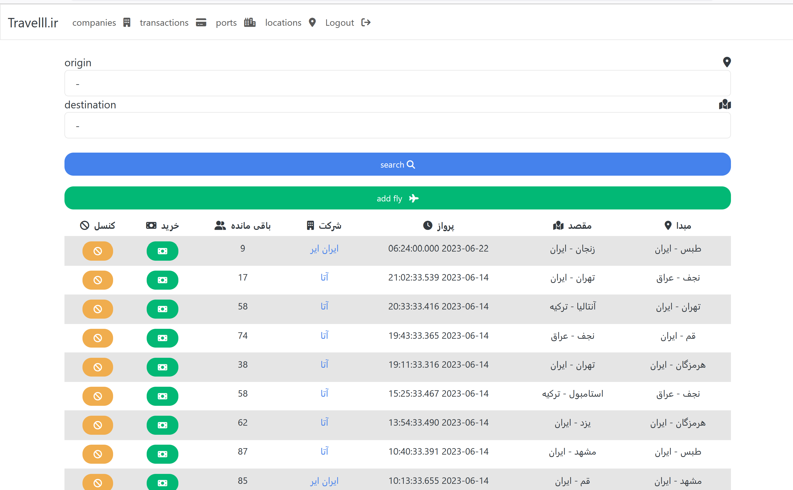
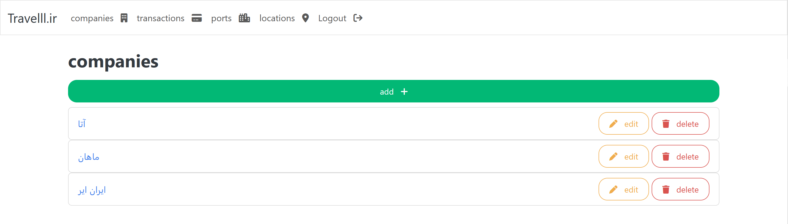
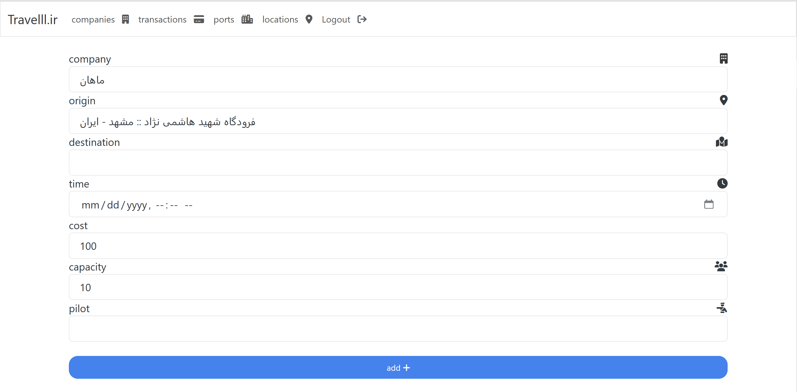
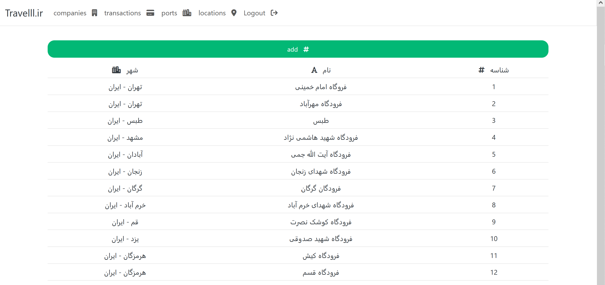
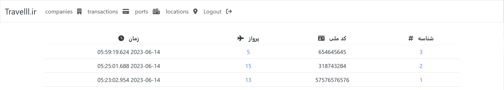

# Airport

## About
The puporse of this project is to putting into practice what we've learned so far in DataBase Labratory.

Which is some basic *SQL* queries and connecting an app to it.

## How to Run
copy new sqlite `dll` from its website and name it `sqlite3_64.dll` :: [sqlite download page](https://www.sqlite.org/download.html)

## UI
1. [Font-Awesome v6](https://fontawesome.com/search?o=r&m=free)
2. [bootswatch.com](bootswatch.com)

## Demo

### main page

### companies page

### add travel page

### ports page

### transactions
